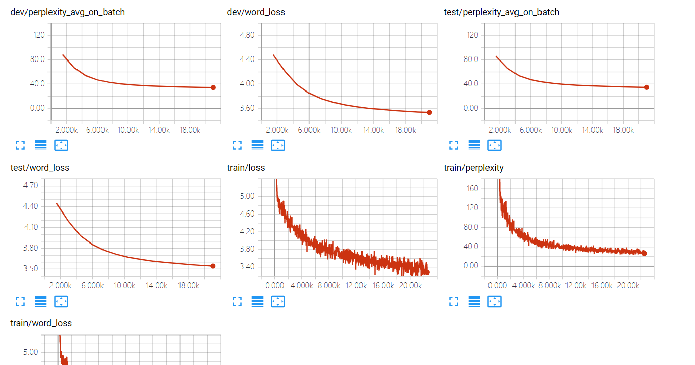

# 实验记录

```bash
valid vocab list length = 1333
vocab list length = 15972
train set. invalid rate: 0.118166, unknown rate: 0.000000, max length before cut: 30, cut word rate: 0.000000
dev set. invalid rate: 0.120105, unknown rate: 0.000000, max length before cut: 30, cut word rate: 0.000000
test set. invalid rate: 0.131301, unknown rate: 0.000000, max length before cut: 30, cut word rate: 0.000000
wordvec cannot cover 0.038260 vocab
```

## run20190711_160735_160745


### 参数

| encoder | decoder | droprate | batchnorm | epoch |
| :-----: | :-----: | :------: | :-------: | :---: |
|   64    |   64    |   0.2    |     √     |  15   |

### 结果评估

#### dev Test Result:

|     perplexity     |        BLEU         |
| :----------------: | :-----------------: |
| 109.51816643711956 | 0.04531705990324727 |

#### test Test Result:

|     perplexity     |        BLEU         |
| :----------------: | :-----------------: |
| 115.96651116651076 | 0.04532902293995862 |

## run20190713_162704_162717

### 参数


| encoder | decoder | droprate | batchnorm | epoch |
| :-----: | :-----: | :------: | :-------: | :---: |
|   32    |   32    |   0.2    |     √     |  15   |

### 结果评估

#### dev Test Result:

|     perplexity     |        BLEU         |
| :----------------: | :-----------------: |
| 118.15614855890941 | 0.04538498879181982 |

#### test Test Result:

|     perplexity     |         BLEU         |
| :----------------: | :------------------: |
| 125.53938172860286 | 0.045401055332467674 |

## run20190713_182543_182557



### 参数

| encoder | decoder | droprate | batchnorm | epoch |
| :-----: | :-----: | :------: | :-------: | :---: |
|   128   |   128   |   0.2    |     √     |  15   |

### 结果评估

#### dev Test Result:

|    perplexity     |        BLEU         |
| :---------------: | :-----------------: |
| 98.65707529109315 | 0.04582918751246812 |

#### test Test Result:

|     perplexity     |        BLEU         |
| :----------------: | :-----------------: |
| 104.44988084899535 | 0.04537367637836227 |

